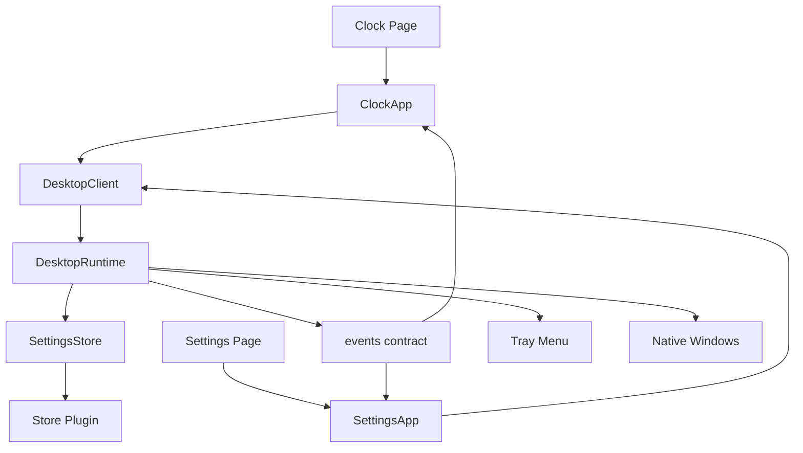
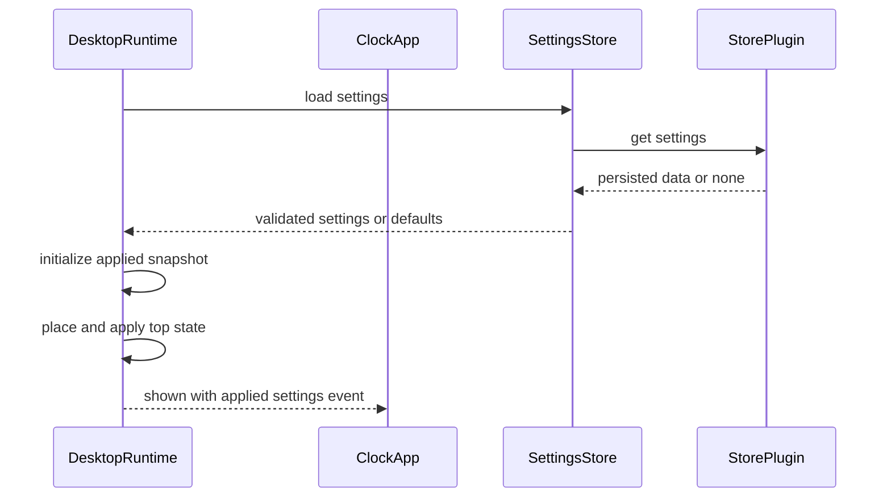
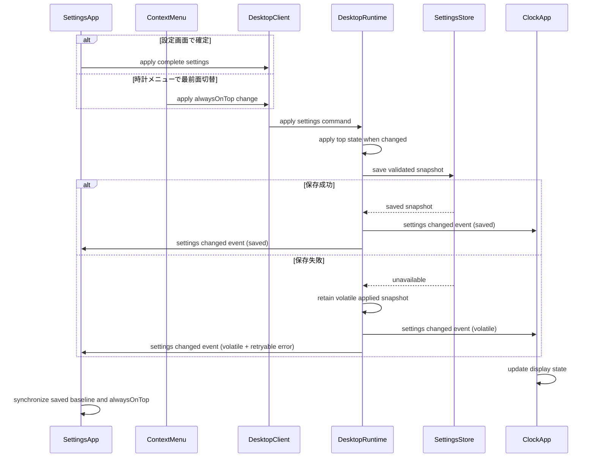
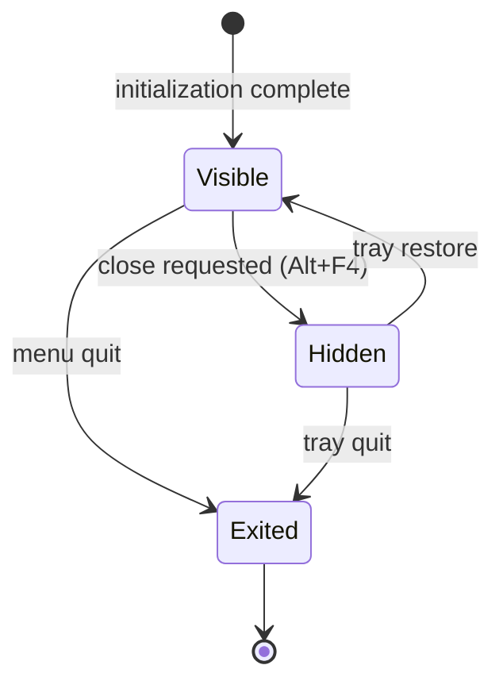

# 技術設計書: Minimal Always-on-Top Clock

## Overview

本機能は、Windows 上で作業中の利用者に、邪魔にならない小型時計を常時参照できるデスクトップアプリを提供する。アプリは時計ウィンドウと設定ウィンドウを React で表示し、Tauri v2/Rust のデスクトップランタイムがウィンドウ寿命、トレイ、配置、最前面、終了を制御する。

本リポジトリは現時点でアプリ実装を持たないため、設計は新規構成である。設定は型付きの単一スナップショットとして扱い、時計メニューと設定画面の変更を Rust 側の `DesktopRuntime` に集約して、適用・保存・画面間通知を処理する。通常は保存済み状態を通知し、最前面適用後に永続化のみ失敗した場合はランタイムが適用中だが未保存の状態を保持して再試行可能にする。これにより、独立した複数 WebView 間でも表示中の状態を一貫させ、即時反映と再起動後復元を成立させる。

### Goals

- Windows で枠なし・半透明・配置済みの時計を安定して表示する。
- デジタル／アナログ表示と設定変更を、永続化と即時同期を伴って提供する。
- トレイ常駐と明示終了を、限定されたネイティブ境界で提供する。
- 秒非表示時および非表示時の不要な描画更新を抑制する。

### Non-Goals

- macOS または Linux における動作保証。
- サイズ、色、透明度などの外観カスタマイズ。
- 時計ウィンドウの移動位置の永続化。
- 自動更新、起動時自動実行、国際化設定の提供。

## Boundary Commitments

### This Spec Owns

- `main` 時計ウィンドウおよび `settings` 設定ウィンドウの表示動作とユーザーフロー。
- `ClockSettings` の型、初期値、検証、保存、変更通知契約。
- トレイメニュー、非表示／再表示、完全終了、時計ウィンドウの初期配置と最前面状態適用。
- Windows 向けの透明・枠なし時計表示に必要なアプリ設定および検証。

### Out of Boundary

- OS のシステム時計、タイムゾーン、ディスプレイ設定の変更。
- 将来プラットフォームに固有の振る舞いおよびインストーラー配布要件。
- 設定スキーマに存在しない装飾設定またはウィンドウ位置保存。
- アプリ本体以外による設定ファイルの編集支援や移行 UI。

### Allowed Dependencies

- Tauri v2 の Window、Tray、Menu、Event、Capability API と Rust 側から利用する Store 公式プラグイン。
- React + TypeScript + Vite によるローカル UI 構築。
- Rust 標準機能および Tauri ランタイム API による Windows ネイティブ動作。
- ローカル OS が提供する現在日時、プライマリモニタ情報、WebView2 ランタイム。

### Revalidation Triggers

- `ClockSettings` または `SettingsChangedPayload` のフィールドや初期値の変更。
- 時計以外のウィンドウ、追加メニュー、外観設定、位置復元の追加。
- WebView へ付与する capability または Rust コマンド公開範囲の変更。
- Windows 以外をサポート対象に追加する変更、または Tauri の major version 変更。

## Architecture

### Existing Architecture Analysis

- 現在は仕様ファイル、要求元資料、および空の npm lockfile metadata のみで、`package.json`、既存 UI、Rust backend、テスト資産はない。
- `.kiro/steering/` の方針文書は存在しない。新たに方針が作成された場合、本設計との整合を再確認する。
- `draft.md` の指定技術と要件文書をアプリ基盤の拘束条件として扱う。

### Architecture Pattern & Boundary Map



**Architecture Integration**:
- **Selected pattern**: Rust desktop shell と型付き React UI の分離。OS 権限を Rust に集約し、表示と設定スキーマを TypeScript に集約する。
- **Domain/feature boundaries**: `DesktopRuntime` はネイティブ寿命とプロセス内の適用済み設定状態を所有し、Rust 側 `SettingsStore` は永続設定の検証・保存・復元のみを所有する。時計描画は `ClockPage` の責任である。
- **New components rationale**: 複数 WebView 入口からの設定適用と `saved/volatile` 状態はランタイムで一意に所有する。設定永続化、通知、タイマー、ネイティブコマンドは要件間で共有されるため専用境界を設ける。
- **Dependency direction**: `types` → `settings/events/time` → `controllers/hooks` → `views` → `entries`。Rust 内では `commands` → `desktop runtime` の方向とし、UI は Rust 内部状態を直接所有しない。
- **Steering compliance**: steering 文書は不在であるため、要件と公式 API に基づく最小権限・単一責任・型安全を設計原則とする。

### Technology Stack

| Layer | Choice / Version | Role in Feature | Notes |
|-------|------------------|-----------------|-------|
| Frontend | React 19.x + TypeScript 5.x | 時計画面、設定画面、型付き状態 | `any` を禁止し、2 HTML entry を構築 |
| Build | Vite 7.x | React の開発・ビルドと複数 HTML entry | 実装時に lockfile へ固定 |
| Desktop Runtime | Tauri v2 + Rust stable | ウィンドウ、トレイ、コマンド、終了制御 | `tray-icon` feature を有効化 |
| Data / Storage | `tauri-plugin-store` v2 (Rust) | `ClockSettings` のローカル永続化 | WebView へ Store API は公開しない |
| Messaging / Events | `@tauri-apps/api` v2 Event | 設定保存後の画面間通知 | `emitTo` と `listen` を型付き利用 |
| Runtime | Windows + WebView2 | MVP 実行環境 | 透明表示とトレイは実機確認 |

## File Structure Plan

### Directory Structure

```text
index.html                              # 時計ウィンドウの HTML entry
settings.html                           # 設定ウィンドウの HTML entry
package.json                            # frontend と Tauri コマンド、依存定義
tsconfig.json                           # TypeScript 厳格設定
vite.config.ts                          # 2 entry のビルド構成
src/
├── clock-entry.tsx                     # 時計ページの React mount
├── settings-entry.tsx                  # 設定ページの React mount
├── domain/
│   ├── settings.ts                     # ClockSettings 型、初期値、検証規則
│   └── events.ts                       # SettingsChangedPayload とイベント名
├── services/
│   ├── desktop-client.ts               # Rust command の型付き呼出境界
│   └── clock-scheduler.ts              # 秒または分境界の tick 計画
├── clock/
│   ├── ClockApp.tsx                    # 時計画面の状態統合と初期化
│   ├── DigitalClock.tsx                # デジタル表示
│   ├── AnalogClock.tsx                 # SVG アナログ表示
│   └── ContextMenu.tsx                 # 時計上の操作メニュー
├── settings/
│   └── SettingsApp.tsx                 # 設定フォームと保存通知
└── styles/
    ├── clock.css                       # 透明時計表示とドラッグ領域
    └── settings.css                    # 設定画面表示
src-tauri/
├── Cargo.toml                          # Tauri と Store plugin、tray feature
├── tauri.conf.json                     # clock 初期非表示とウィンドウ静的属性
├── capabilities/
│   └── default.json                    # window ごとの許可 API
├── icons/                              # アプリおよびトレイアイコン
└── src/
    ├── main.rs                         # バイナリエントリ
    ├── lib.rs                          # builder と plugin 組立
    ├── settings_store.rs               # 設定 JSON の load save fallback
    ├── desktop_runtime.rs              # tray window lifecycle placement exit
    └── commands.rs                     # frontend 公開コマンド
```

### File Responsibility Map

| Path | Component / Responsibility |
|------|----------------------------|
| `src/domain/settings.ts` | settings domain: 設定型、既定値、検証 |
| `src/domain/events.ts` | events contract: 設定変更と表示状態 payload |
| `src/services/desktop-client.ts` | DesktopClient: Rust command 呼出 |
| `src/services/clock-scheduler.ts` | ClockScheduler: 表示更新計画 |
| `src/clock/ClockApp.tsx` | ClockApp: 時計画面 controller |
| `src/clock/DigitalClock.tsx` | DigitalClock: 数値表示 |
| `src/clock/AnalogClock.tsx` | AnalogClock: SVG 表示 |
| `src/clock/ContextMenu.tsx` | ContextMenu: 時計操作 |
| `src/settings/SettingsApp.tsx` | SettingsApp: 設定画面 controller |
| `src-tauri/src/desktop_runtime.rs` | DesktopRuntime: native window と tray 寿命 |
| `src-tauri/src/settings_store.rs` | SettingsStore: 設定検証、保存、復元、既定値復旧 |
| `src-tauri/src/commands.rs` | frontend へ許可する native commands |
| `src-tauri/src/lib.rs` | plugin、tray、handler の構成 |
| `src-tauri/tauri.conf.json` | 時計ウィンドウの静的構成 |
| `src-tauri/capabilities/default.json` | WebView ごとの許可権限 |

### Added Files

- `package.json` - React/Vite/Tauri 開発およびテスト構成を新規に定義する。
- `package-lock.json` - 作業ディレクトリに存在する未追跡の空 lockfile metadata を、採用した npm 依存の解決結果で更新して追加する。
- `.kiro/specs/minimal-always-on-top-clock/*` - 本設計および後続タスクの根拠文書であり、アプリ実装には取り込まない。

## System Flows

### 起動と設定復元



初期状態の最前面設定が誤表示されないよう、時計ウィンドウはランタイムによる設定ロード、適用済み状態初期化、配置、最前面適用の完了まで表示しない。Store 障害は初期設定への復旧として扱う。

### 設定変更同期



イベント payload は適用された設定の全体スナップショットと永続化状態を含み、変更入口にかかわらず `main` と `settings` の双方へ配信する。`DesktopRuntime` はプロセス実行中の authoritative applied snapshot を保持する。`alwaysOnTop` を変更する場合は、ネイティブ適用が成功した後に保存する。ネイティブ適用に失敗した場合は保存値と画面状態を変更しない。ネイティブ適用後に保存だけが失敗した場合は、実ウィンドウに一致するスナップショットを `volatile` として保持・通知し、設定画面に未保存状態と再試行操作を示す。設定画面が未保存の編集内容を保持している場合、外部から適用された `alwaysOnTop` と適用済み基準値だけを同期し、他の編集中項目を失わない。時計画面の再表示および設定画面の再オープンでは、ランタイムの applied snapshot を command で取得して Store より優先し、冷間起動時のみ Store の永続値をランタイム状態へロードする。

### ウィンドウ寿命



## Requirements Traceability

| Requirement | Summary | Components | Interfaces | Flows |
|-------------|---------|------------|------------|-------|
| 1.1 | 右上への初期表示 | DesktopRuntime, ClockApp | `initializeClockWindow` | 起動と設定復元 |
| 1.2 | 枠なし半透明表示 | DesktopRuntime, clock.css | Tauri window config | 起動と設定復元 |
| 1.3 | 初回最前面 | DesktopRuntime, settings domain | `DEFAULT_CLOCK_SETTINGS` | 起動と設定復元 |
| 1.4 | ドラッグ移動 | ClockApp, clock.css | drag region | - |
| 2.1 | 現在日時表示 | ClockApp, ClockScheduler | clock state | - |
| 2.2 | 秒単位更新 | ClockScheduler | `scheduleNextTick` | - |
| 2.3 | 分単位更新 | ClockScheduler | `scheduleNextTick` | - |
| 2.4 | 日付表示 | DigitalClock, AnalogClock | `ClockViewProps` | - |
| 2.5 | 日付非表示 | DigitalClock, AnalogClock | `ClockViewProps` | - |
| 3.1 | デジタル表示 | DigitalClock | `ClockViewProps` | - |
| 3.2 | 24時間表記 | DigitalClock | `ClockSettings` | - |
| 3.3 | 12時間表記 | DigitalClock | `ClockSettings` | - |
| 3.4 | アナログ表示 | AnalogClock | `ClockViewProps` | - |
| 3.5 | 秒針表示 | AnalogClock | `ClockSettings` | - |
| 3.6 | 秒針非表示 | AnalogClock | `ClockSettings` | - |
| 4.1 | 時計メニュー | ContextMenu | `DesktopClient` | - |
| 4.2 | 最前面状態提示 | ContextMenu, ClockApp | `ClockSettings` | 設定変更同期 |
| 4.3 | 最前面切替 | ContextMenu, DesktopClient, DesktopRuntime | `applySettings`, `setAlwaysOnTop` | 設定変更同期 |
| 4.4 | 既定メニュー抑止 | ContextMenu | browser context event | - |
| 5.1 | 設定ウィンドウ表示 | DesktopRuntime | `openSettingsWindow` | - |
| 5.2 | 設定重複防止 | DesktopRuntime | `openSettingsWindow` | - |
| 5.3 | 設定項目提供 | SettingsApp | `ClockSettings` | - |
| 5.4 | 表示即時反映 | DesktopRuntime, SettingsApp, ClockApp | `SettingsChangedPayload` | 設定変更同期 |
| 5.5 | 最前面即時反映 | DesktopRuntime, ClockApp | `applySettings`, `setAlwaysOnTop` | 設定変更同期 |
| 6.1 | 初期値 | settings domain, SettingsStore | `DEFAULT_CLOCK_SETTINGS` | 起動と設定復元 |
| 6.2 | 保存 | DesktopRuntime, SettingsStore | `applySettings`, `saveSettings` | 設定変更同期 |
| 6.3 | 復元 | DesktopRuntime, SettingsStore, ClockApp | `loadSettings`, `getAppliedSettings` | 起動と設定復元 |
| 6.4 | 読込障害復旧 | SettingsStore | `SettingsLoadResult` | 起動と設定復元 |
| 7.1 | トレイ常駐 | DesktopRuntime | tray menu contract | ウィンドウ寿命 |
| 7.2 | close 時非表示 | DesktopRuntime | close requested handler | ウィンドウ寿命 |
| 7.3 | トレイ復帰 | DesktopRuntime, ClockApp | restore event | ウィンドウ寿命 |
| 7.4 | トレイ操作 | DesktopRuntime | tray menu contract | ウィンドウ寿命 |
| 7.5 | 完全終了 | DesktopRuntime | `quitApplication` | ウィンドウ寿命 |
| 8.1 | 秒非表示の更新抑制 | ClockScheduler | `scheduleNextTick` | - |
| 8.2 | 非表示中の視覚更新抑制 | DesktopRuntime, ClockApp | visibility event | ウィンドウ寿命 |

## Components and Interfaces

| Component | Domain/Layer | Intent | Req Coverage | Key Dependencies | Contracts |
|-----------|--------------|--------|--------------|------------------|-----------|
| settings domain | Domain | 設定型と既定値を定義 | 3.2, 3.3, 5.3, 6.1 | none | State |
| events contract | Domain | 適用設定と永続化状態の通知 payload を定義 | 4.3, 5.4, 5.5, 6.2, 7.3, 8.2 | settings domain P1 | Event |
| SettingsStore | Rust service | 設定の検証と永続化 | 6.1, 6.2, 6.3, 6.4 | Store plugin P0 | Service, State |
| DesktopClient | Frontend adapter | 許可済み Rust 操作と設定適用状態を型付き呼出 | 1.1, 4.3, 5.1, 5.5, 6.2, 6.3, 7.5 | Commands P0 | Service |
| ClockScheduler | Frontend service | 必要な粒度のみ tick を発生 | 2.1, 2.2, 2.3, 8.1, 8.2 | Date P0 | Service |
| ClockApp | UI controller | 時計画面状態と同期を統合 | 1.4, 2.1, 4.2, 5.4, 6.3, 7.3 | DesktopClient P0, events contract P0 | State, Event |
| SettingsApp | UI controller | 設定編集と適用済み状態同期を統合 | 5.3, 5.4, 6.2 | DesktopClient P0, events contract P0 | State, Event |
| DigitalClock | UI view | 数値形式の日時を表示 | 2.4, 2.5, 3.1, 3.2, 3.3 | settings domain P1 | State |
| AnalogClock | UI view | SVG 時計盤を表示 | 2.4, 2.5, 3.4, 3.5, 3.6 | settings domain P1 | State |
| ContextMenu | UI view | 時計の操作メニューを表示 | 4.1, 4.2, 4.3, 4.4 | DesktopClient P0, ClockApp P1 | State |
| DesktopRuntime | Rust runtime | ネイティブ寿命、設定適用状態、および通知を所有 | 1.1, 1.2, 1.3, 4.3, 5.1, 5.2, 5.4, 5.5, 6.2, 6.3, 7.1, 7.2, 7.3, 7.4, 7.5 | Tauri P0, SettingsStore P0 | Service, Event, State |

### Domain and Frontend Services

#### SettingsStore

| Field | Detail |
|-------|--------|
| Intent | Rust ランタイム内で設定スナップショットの検証、保存、復元を単独で所有する |
| Requirements | 6.1, 6.2, 6.3, 6.4 |

**Responsibilities & Constraints**
- `ClockSettings` の保存キーと既定値を所有する。
- Store から取得した値を検証し、不正または取得不能なら初期値へ復旧する。
- 永続化に成功した値を永続復元の候補として返す。適用後の保存失敗で生じる `volatile` 状態は `DesktopRuntime` が所有し、`SettingsStore` は捏造しない。

**Dependencies**
- Inbound: `DesktopRuntime` - 設定の保存要求および冷間起動時の読込要求 (P0)
- External: Rust 側 `tauri-plugin-store` v2 - ローカル永続化 (P0)

**Contracts**: Service [x] / API [ ] / Event [ ] / Batch [ ] / State [x]

##### Service Interface

```typescript
type ClockMode = "digital" | "analog";

interface ClockSettings {
  mode: ClockMode;
  showSeconds: boolean;
  hour24: boolean;
  showDate: boolean;
  alwaysOnTop: boolean;
}

type SettingsLoadResult =
  | { kind: "loaded"; settings: ClockSettings }
  | { kind: "defaulted"; settings: ClockSettings; reason: "missing" | "invalid" | "unavailable" };

```

```rust
trait SettingsStore {
    fn load_settings(&self) -> Result<SettingsLoadResult, SettingsError>;
    fn save_settings(&self, settings: ClockSettings) -> Result<ClockSettings, SettingsError>;
}
```

- **Preconditions**: 保存入力は `ClockSettings` の全項目を持ち、UI 契約および `SettingsStore` 境界で検証される。
- **Postconditions**: `save_settings` 成功後、同一スナップショットが次回 `load_settings` の候補となる。
- **Invariants**: 未定義の拡張フィールドは MVP の表示または保存契約に含めない。

**Implementation Notes**
- Integration: Store plugin は Rust ランタイム内で利用し、時計および設定ウィンドウには設定 command/event のみを公開する。
- Validation: 欠損、型不一致、Store 失敗を各々 default 復旧テストで確認する。
- Risks: ネイティブ状態を変更していない通常の保存失敗時は UI に保存不能を通知し、未適用値をイベント発行しない。`alwaysOnTop` のネイティブ適用後に保存だけ失敗した場合は、`DesktopRuntime` が実際に適用中の値を `volatile` として通知し、永続化未完了と再試行を表示する。

#### ClockScheduler

| Field | Detail |
|-------|--------|
| Intent | 秒設定と表示状態に応じた日時更新契約を提供する |
| Requirements | 2.1, 2.2, 2.3, 8.1, 8.2 |

**Dependencies**
- Inbound: `ClockApp` - 表示用日時更新の購読 (P0)
- External: JavaScript `Date` / timer - OS 時刻に基づく tick (P0)

**Contracts**: Service [x] / API [ ] / Event [ ] / Batch [ ] / State [ ]

##### Service Interface

```typescript
interface ClockScheduleOptions {
  showSeconds: boolean;
  visible: boolean;
}

interface ClockScheduler {
  start(options: ClockScheduleOptions, onTick: (now: Date) => void): () => void;
  restart(options: ClockScheduleOptions): void;
}
```

- **Preconditions**: `visible` はランタイムの表示状態通知と一致する。
- **Postconditions**: 秒ありでは秒境界、秒なしでは分境界でのみ次の tick を通知する。非表示では通知しない。
- **Invariants**: 同時に稼働する active timer は一つまでとする。

**Implementation Notes**
- Integration: 設定変更または表示状態変更で schedule を再計算する。
- Validation: fake timer により秒境界、分境界、hidden 停止を検証する。
- Risks: 復帰直後の日時陳腐化は、再表示時の即時 tick で解消する。

#### DesktopClient

| Field | Detail |
|-------|--------|
| Intent | React から公開可能なデスクトップ操作と適用設定状態のみを呼び出す |
| Requirements | 1.1, 4.3, 5.1, 5.5, 6.2, 6.3, 7.5 |

**Dependencies**
- Inbound: `ClockApp`, `SettingsApp`, `ContextMenu` - ユーザー操作または設定状態照会 (P0)
- Outbound: Rust `commands.rs` - ネイティブ処理 (P0)

**Contracts**: Service [x] / API [ ] / Event [ ] / Batch [ ] / State [ ]

##### Service Interface

```typescript
type DesktopCommandError =
  | { kind: "window-unavailable"; operation: string }
  | { kind: "runtime-failure"; operation: string; message: string };

interface DesktopClient {
  initializeClockWindow(): Promise<SettingsChangedPayload>;
  openSettingsWindow(): Promise<void>;
  getAppliedSettings(): Promise<SettingsChangedPayload>;
  applySettings(settings: ClockSettings): Promise<SettingsChangedPayload>;
  retrySettingsPersistence(): Promise<SettingsChangedPayload>;
  quitApplication(): Promise<void>;
}
```

- **Preconditions**: 初期化はランタイムが `SettingsStore` のロード結果から applied snapshot を確立した後に一度だけ完了する。
- **Postconditions**: ランタイムから返された applied snapshot のみ UI 状態として表示し、`volatile` 状態では永続化未完了を示す。
- **Invariants**: frontend はウィンドウ生成やプロセス終了の Tauri API を直接呼び出さない。

### UI Components

`DigitalClock` と `AnalogClock` は以下の共通 props のみに依存し、永続化やネイティブ操作を行わない。

```typescript
interface ClockViewProps {
  now: Date;
  settings: ClockSettings;
}
```

- `ClockApp` はランタイムが初期化した applied snapshot、`ClockScheduler`、設定イベント listener、表示状態イベント listener を組み合わせ、表示モードに応じて view を選択する。
- `SettingsApp` は `ClockSettings` 全項目を編集し、`DesktopClient` 経由でランタイムへ適用を要求する。また、時計メニューから適用された設定イベントを購読して適用済み基準値と `alwaysOnTop` の編集値を同期する。
- `ContextMenu` はブラウザ既定メニューを抑止し、設定表示、最前面切替、終了だけを公開する。最前面切替は `DesktopClient` 経由でランタイムに要求し、返却された `saved` または `volatile` 状態だけを表示する。
- `AnalogClock` は SVG で時針、分針、条件付き秒針を描画する。

### Native Runtime

#### DesktopRuntime

| Field | Detail |
|-------|--------|
| Intent | OS と結合するウィンドウ寿命とプロセス内の適用設定状態を所有する |
| Requirements | 1.1, 1.2, 1.3, 4.3, 5.1, 5.2, 5.4, 5.5, 6.2, 6.3, 7.1, 7.2, 7.3, 7.4, 7.5 |

**Responsibilities & Constraints**
- `main` を初期非表示、枠なし、透明、固定サイズ、タスクバー非表示として構成する。
- 冷間起動時に `SettingsStore` から保存成功値または既定値を読み込み、プロセス内の applied snapshot を初期化する。
- `apply_settings` と `retry_settings_persistence` を通じて適用済み設定の `saved/volatile` 状態を一意に保持し、両 WebView へ通知する。
- `initialize_clock_window` でプライマリ作業領域右上への配置、最前面適用、初回表示を順に完了する。
- 時計ウィンドウで Windows 標準の `Alt+F4` により発生する close request を非表示処理へ置換し、トレイの restore/settings/quit を処理する。
- 設定ウィンドウは一つだけ生成または再フォーカスする。

**Dependencies**
- Inbound: `DesktopClient` - 設定画面操作および初期化 (P0)
- External: Tauri v2 Window/Menu/Tray API - ネイティブ制御 (P0)
- External: Windows monitor/work-area 情報 - 右上配置 (P1)

**Contracts**: Service [x] / API [ ] / Event [x] / Batch [ ] / State [x]

##### Service Interface

```rust
#[tauri::command]
fn initialize_clock_window() -> Result<SettingsChangedPayload, DesktopError>;

#[tauri::command]
fn open_settings_window() -> Result<(), DesktopError>;

#[tauri::command]
fn get_applied_settings() -> Result<SettingsChangedPayload, DesktopError>;

#[tauri::command]
fn apply_settings(settings: ClockSettings) -> Result<SettingsChangedPayload, DesktopError>;

#[tauri::command]
fn retry_settings_persistence() -> Result<SettingsChangedPayload, DesktopError>;

#[tauri::command]
fn quit_application() -> Result<(), DesktopError>;
```

##### Event Contract

- Published events: `clock-settings://changed` with `SettingsChangedPayload` after settings apply/retry and `clock-window://visibility` with payload `{ visible: boolean }` on tray restore and close-to-hide.
- Subscribed events: なし。ネイティブ操作は commands と tray events から受ける。
- Ordering / delivery guarantees: visibility は操作完了後に現在状態を通知する。時計 UI は復帰通知で settings と時刻を再同期する。

##### State Management

- State model: `ClockWindowState = HiddenUntilInitialized | Visible | HiddenToTray | Exiting`
- Persistence & consistency: `DesktopRuntime` が current applied snapshot と `saved/volatile` をプロセス内で所有し、Rust 側 `SettingsStore` が保存成功値を Store に保持する。冷間起動は Store 値から再構築し、同一プロセス内の restore/settings 再オープンはランタイム状態を優先する。
- Concurrency strategy: 退出開始後は restore/open settings 要求を無視し、複数 settings open 要求は既存ウィンドウ focus に収束させる。

**Implementation Notes**
- Integration: Store plugin の登録、tray feature、有効 capability、command handler を `lib.rs` に集約する。
- Validation: Windows 実機で透明表示、配置、close-to-hide、tray restore、quit を確認する。
- Risks: work area 取得失敗時は現在モニタまたは既定位置へ表示して起動不能を避ける。

## Data Models

### Domain Model

- **Aggregate**: `ClockSettings` は利用者の時計表示設定の完全スナップショットであり、部分更新は保存前に完全値へ統合される。
- **Value Objects**: `ClockMode`、`SettingsChangedPayload`、`ClockWindowVisibilityPayload`。
- **Invariants**:
  - `mode` は `"digital"` または `"analog"` のみである。
  - `showSeconds`、`hour24`、`showDate`、`alwaysOnTop` は boolean である。
  - 初期値は digital / seconds on / 24 hour / date off / topmost on である。

### Logical Data Model

| Data Item | Attributes | Owner | Persistence |
|-----------|------------|-------|-------------|
| `ClockSettings` | `mode`, `showSeconds`, `hour24`, `showDate`, `alwaysOnTop` | SettingsStore | Store JSON |
| `SettingsChangedPayload` | `settings: ClockSettings`, `persistence: "saved" \| "volatile"` | DesktopRuntime | event only |
| `ClockWindowVisibilityPayload` | `visible: boolean` | DesktopRuntime | event only |

**Consistency & Integrity**:
- Store には一つの設定スナップショットを保存し、設定変更は全体置換として扱う。
- `DesktopRuntime` は通常は保存完了したスナップショットを両ウィンドウへイベント配信する。最前面のネイティブ適用後に保存不能となった場合のみ、適用中の状態を `volatile` として配信して表示と実状態の不一致を防ぐ。
- `volatile` は当該プロセス内の current applied snapshot として `DesktopRuntime` が保持する。プロセス再起動後は Store の最後に保存成功した値から起動し、未保存であった変更は復元しない。
- 取得不能または不正データは既定値へ置換し、起動を継続する。

### Data Contracts & Integration

```typescript
interface SettingsChangedPayload {
  settings: ClockSettings;
  persistence: "saved" | "volatile";
}

interface ClockWindowVisibilityPayload {
  visible: boolean;
}
```

- Event names: `clock-settings://changed`, `clock-window://visibility`
- Delivery targets: `clock-settings://changed` は変更入口と永続化成否にかかわらず、適用済み状態を `main` と `settings` の双方へ配信する。
- State priority: cold start は Store の保存成功値で current applied snapshot を初期化する。同一プロセス内の restore、settings 再オープン、および再試行では current applied snapshot が Store より優先される。
- Settings draft reconciliation: `settings` が未保存編集を保持中に外部の最前面変更を受けた場合、`alwaysOnTop` と適用済み基準値を更新し、その他の編集中フィールドは保持する。`volatile` の場合は永続化未完了と再試行操作も表示する。
- Listener lifecycle: React mount 時に購読し、unmount 時に必ず解除する。
- Capability: `main` と `settings` へ Event および定義した command の必要権限のみを付与し、Store の直接操作権限は付与しない。

## Error Handling

### Error Strategy

- 設定読込の失敗、不正値、不在は `SettingsLoadResult.defaulted` として既定値へ復旧し、時計を表示可能にする。
- 通常の設定保存の失敗は操作元 UI に失敗状態を表示し、変更通知を適用しない。最前面のネイティブ適用後に保存が失敗した場合は、適用中の設定を `volatile` として `DesktopRuntime` に保持し両画面に同期する。次回起動へ保持されていないことと保存再試行を明示し、同一プロセス内の再表示や設定再オープンではこの適用済み値を維持する。
- 初期配置の monitor 情報取得失敗は配置フォールバックで継続し、表示自体を停止しない。
- ネイティブコマンド失敗は操作元 UI に保持し、UI のチェック状態を未適用値へ先行変更しない。

### Monitoring

- 開発および手動検証では Rust 側に初期化、close-to-hide、tray action、command failure の診断ログを出力する。
- 永続設定の値そのものは機密ではないが、通常動作時に過剰なログを残さない。

## Testing Strategy

### Unit Tests

- `settings.ts` と Rust 側 `settings_store.rs`: 既定値、完全な設定値、欠損／無効／取得失敗時の復旧を検証する。対象: 6.1, 6.2, 6.3, 6.4。
- `clock-scheduler.ts`: 秒表示ありの秒境界、秒表示なしの分境界、非表示で timer 通知停止を fake timer で検証する。対象: 2.2, 2.3, 8.1, 8.2。
- `DigitalClock.tsx`: 12/24 時間表示と日付表示条件を固定日時で検証する。対象: 2.4, 2.5, 3.1, 3.2, 3.3。
- `AnalogClock.tsx`: SVG の針構成と秒針条件を固定日時で検証する。対象: 3.4, 3.5, 3.6。
- `ContextMenu.tsx`: 右クリック時のメニュー項目、最前面チェック状態、既定 context menu 抑止を検証する。対象: 4.1, 4.2, 4.4。

### Integration Tests

- Tauri API mock を用い、設定適用成功後に `clock-settings://changed` が発行され ClockApp の表示状態がランタイムの applied snapshot と一致することを検証する。対象: 4.3, 5.4, 5.5, 6.2。
- Tauri API mock を用い、時計メニューから `alwaysOnTop` を変更した後に開いている設定画面が同じ保存済み値へ同期し、別の設定保存で最前面値を巻き戻さないことを検証する。対象: 4.2, 4.3, 5.4, 5.5, 6.2。
- Tauri API mock を用い、最前面適用失敗時は設定を保存も通知もせず、ネイティブ適用後の保存失敗時は `volatile` 状態が両画面へ同期されて保存を再試行でき、hide/restore と settings 再オープンでも古い Store 値へ巻き戻らないことを検証する。対象: 4.3, 5.5, 6.2, 6.3, 7.3。
- DesktopRuntime の起動で `SettingsStore` から設定取得後に配置と初回表示を一度だけ行い、既定値復旧時も applied snapshot を UI へ通知して表示へ進むことを検証する。対象: 1.1, 1.3, 6.1, 6.4。
- Rust 側テスト可能境界で、settings window の再オープンが重複生成でなく focus 操作へ収束することを検証する。対象: 5.1, 5.2。
- Rust 側で `Alt+F4` による close request が hide と visibility event に変換され、quit action のみ exit を発行することを検証する。対象: 7.2, 7.3, 7.5。

### E2E / Windows Smoke Tests

- Windows で起動し、右上付近に枠なし半透明時計が表示され、ドラッグ移動と初期最前面が成立することを確認する。対象: 1.1, 1.2, 1.3, 1.4。
- 設定画面で各表示設定を変更し、時計へ直ちに反映され、再起動後にも復元されることを確認する。対象: 3.1, 3.2, 3.3, 3.4, 3.5, 3.6, 5.3, 5.4, 5.5, 6.2, 6.3。
- 時計メニューとトレイから設定を開き、時計メニューで最前面を切り替えても開いた設定画面と保存値が整合することを確認する。`Alt+F4` による close で常駐し、restore で再表示し、quit で完全終了することを確認する。対象: 4.1, 4.2, 4.3, 4.4, 5.4, 5.5, 6.2, 7.1, 7.2, 7.3, 7.4, 7.5。

### Performance Validation

- 秒表示無効時に分境界まで描画更新が発生しないことを UI 計測で確認する。対象: 2.3, 8.1。
- 非表示中に時計の視覚更新が発生せず、再表示直後に正しい現在時刻へ同期することを確認する。対象: 7.3, 8.2。

## Security Considerations

- capability は `main` と `settings` に必要な Event/command 権限のみを付与し、Store の直接操作、ファイルシステム、外部通信権限は付与しない。
- Web UI は外部 HTML またはリモートコンテンツを読み込まず、時計および設定に必要なローカル asset のみを表示する。
- 永続データは機密情報を含まない表示設定に限定する。

## Performance & Scalability

- 時計更新は秒表示時のみ秒境界で行い、秒非表示時は分境界へ低減する。
- 非表示状態ではタイマーによる React 描画を停止し、復帰時に一度現在日時と設定を再同期する。
- 常駐単一利用者向けローカルアプリであり、並列利用者処理や分散スケーリングは対象外である。
